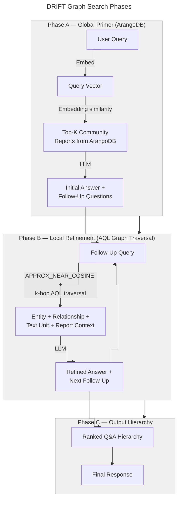

# DRIFT Graph Search 🔎

## DRIFT with ArangoDB Graph Traversal

DRIFT Graph search combines the iterative reasoning of [DRIFT search](drift_search.md) with the ArangoDB-native graph traversal of [graph search](graph_search.md). **ArangoDB is the single source of truth** — community reports for the global priming phase are loaded directly from ArangoDB, and all local refinement steps use AQL graph traversal instead of in-memory entity/relationship filtering.

Like standard DRIFT search, this method balances global breadth (community-level overview) with local depth (entity-level detail), making it suitable for complex, multi-faceted questions. Unlike standard DRIFT, no parquet files are read at query time.

> **Requires** `graph_store.enabled: true` in `settings.yaml` and a completed `graphrag index` run.

## Methodology

DRIFT Graph search follows the same three-phase structure as DRIFT search, but replaces the in-memory local search with ArangoDB AQL traversal in phases B and C:



### Phase A: Global Primer

All community reports are loaded from the `community_reports` collection in ArangoDB (via `get_all_community_reports()`). The query embedding is compared against report embeddings to select the top-K most relevant reports, which seed the initial broad answer and follow-up questions.

### Phase B: Local Refinement (AQL)

Each follow-up question is processed using the same AQL pipeline as `--method graph`:

1. `APPROX_NEAR_COSINE` on `entities.vector` → seed entities
2. k-hop `GRAPH` traversal → neighbor entities + relationship edges
3. `entity_community_membership` traversal → community reports
4. `entity_text_unit` traversal → text units
5. `entity_covariate` traversal → covariates (if `extract_claims` was enabled)

The local context is assembled within a token budget and passed to the LLM for refinement.

### Phase C: Output Hierarchy

Follow-up answers are ranked by relevance and assembled into a final hierarchical response, identical to standard DRIFT.

## Configuration

DRIFT Graph search reuses two existing config sections:

### From `drift_search`

All `drift_search` parameters apply, including:

| Parameter | Description |
|-----------|-------------|
| `completion_model_id` | LLM for response generation |
| `embedding_model_id` | Embedding model |
| `n_depth` | Number of DRIFT refinement iterations |
| `drift_k_followups` | Number of follow-up questions per iteration |
| `primer_folds` | Number of folds for community priming |
| `local_search_text_unit_prop` | Text unit token budget proportion for local steps |
| `local_search_community_prop` | Community report token budget proportion for local steps |
| `local_search_top_k_mapped_entities` | Entity limit per local step |
| `local_search_top_k_relationships` | Relationship limit per local step |
| `local_search_max_data_tokens` | Token budget for each local refinement step |

### From `graph_store`

| Parameter | Description |
|-----------|-------------|
| `url`, `username`, `password`, `db_name` | ArangoDB connection |
| `graph_name` | Name of the ArangoDB named graph |
| `traversal_depth` | k-hop depth for local step graph expansion |
| `top_k_seeds` | Number of vector seed entities per local step |
| `store_vectors` | Must be `true`. Default: `true` |
| `vector_size` | Must match embedding model output dimension |

### Example `settings.yaml` excerpt

```yaml
graph_store:
  enabled: true
  url: "http://localhost:8529"
  username: root
  password: ${ARANGODB_PASSWORD}
  db_name: graphrag
  graph_name: knowledge_graph
  store_vectors: true
  vector_size: 1536
  traversal_depth: 2
  top_k_seeds: 10

drift_search:
  n_depth: 3
  drift_k_followups: 2
  primer_folds: 2
  local_search_text_unit_prop: 0.5
  local_search_community_prop: 0.1
  local_search_top_k_mapped_entities: 10
  local_search_max_data_tokens: 12000
```

## How to Use

```bash
graphrag query \
  --root ./my-project \
  --method drift-graph \
  "What quality assurance processes does company use for sensor calibration?"
```

With streaming:

```bash
graphrag query \
  --root ./my-project \
  --method drift-graph \
  --streaming \
  "How do the sensor variants compare in terms of measurement accuracy?"
```

## Comparison

| | `--method drift` | `--method drift-graph` |
|---|---|---|
| **Parquet at query time** | Yes (entities, relationships, text units) | No |
| **Community priming source** | Parquet-indexed reports | ArangoDB `community_reports` collection |
| **Local refinement** | In-memory filtering | AQL k-hop graph traversal |
| **Multi-hop neighbors** | Via rank/weight heuristics | Direct graph edges |
| **Use when** | Standard setup, parquet available | Production, live data, large graphs |

## Learn More

- [DRIFT Search](drift_search.md) — the standard in-memory variant this method is based on
- [Graph Search](graph_search.md) — the AQL-based local search used in Phase B
- [DRIFT Search blog post](https://www.microsoft.com/en-us/research/blog/introducing-drift-search-combining-global-and-local-search-methods-to-improve-quality-and-efficiency/)
