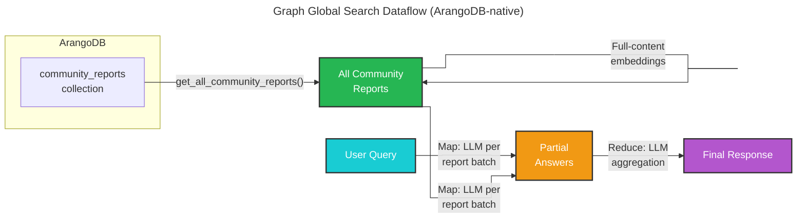

# Graph Global Search 🔎

## ArangoDB-Native Global Search

Graph global search (`--method graph-global`) is an ArangoDB-native alternative to [global search](global_search.md). Community reports are loaded live from ArangoDB and fed into the same GlobalSearch map-reduce pipeline — no parquet files are needed at query time.

This method is best for **broad, cross-cutting questions** where the answer is distributed across many communities in the dataset (e.g. "What are the most common product categories?", "Which customers appear internationally?"). It reads *all* community reports from ArangoDB, making it complementary to graph local search (which focuses on entity neighborhoods).

> **Requires** `graph_store.enabled: true` in `settings.yaml` and a completed `graphrag index` run.

## Methodology



### Step-by-step

1. **Load reports from ArangoDB** — `get_all_community_reports()` fetches all community reports from the `community_reports` collection. Full-content embeddings are loaded from the vector store.
2. **Map phase** — the query is sent to each batch of community reports in parallel. Each LLM call produces a partial answer with a relevance score.
3. **Reduce phase** — high-scoring partial answers are aggregated into a single coherent final response.

## When to Use

| Question type | Recommended mode |
|---|---|
| Specific entity, relationship, or fact | `--method graph-local` |
| Multi-hop reasoning, decomposable queries | `--method graph-drift` |
| Broad enumeration, dataset-wide summaries | **`--method graph-global`** |
| "Which X exist?", "What are all Y?" | **`--method graph-global`** |

## Configuration

Graph global search reuses the `global_search` config section (no dedicated block):

| Parameter | Description |
|-----------|-------------|
| `completion_model_id` | LLM for both map and reduce steps |
| `map_prompt` | System prompt for the map phase |
| `reduce_prompt` | System prompt for the reduce/aggregation phase |
| `knowledge_prompt` | General knowledge inclusion prompt |
| `data_max_tokens` | Maximum tokens per community report batch |
| `max_context_tokens` | Total token budget across all reports |
| `map_max_length` | Max response length for map answers |
| `reduce_max_length` | Max response length for the final answer |

ArangoDB connection uses `graph_store.url`, `graph_store.username`, `graph_store.password`, and `graph_store.db_name`.

### Example `settings.yaml` excerpt

```yaml
graph_store:
  enabled: true
  url: "http://localhost:8529"
  username: root
  password: ${ARANGODB_PASSWORD}
  db_name: graphrag
  graph_name: knowledge_graph

global_search:
  completion_model_id: default_completion_model
  map_prompt: "prompts/global_search_map_system_prompt.txt"
  reduce_prompt: "prompts/global_search_reduce_system_prompt.txt"
  knowledge_prompt: "prompts/global_search_knowledge_system_prompt.txt"
  max_context_tokens: 12000
```

## How to Use

```bash
graphrag query \
  --root ./my-project \
  --method graph-global \
  "Which customers appear in the dataset from outside Germany?"
```

With streaming:

```bash
graphrag query \
  --root ./my-project \
  --method graph-global \
  --streaming \
  "What are the main application domains for the products in this dataset?"
```

## Comparison with Global Search

| | `--method global` | `--method graph-global` |
|---|---|---|
| **Data source** | Parquet files (community_reports.parquet) | ArangoDB `community_reports` collection |
| **Parquet required at query time** | Yes | No |
| **Report loading** | `read_indexer_reports()` | `ArangoDBGraphRetriever.get_all_community_reports()` |
| **Map-reduce pipeline** | Identical | Identical |
| **Use when** | Parquet available | Production, live data, no parquet |

## Learn More

- [Global Search](global_search.md) — the parquet-based variant using the same pipeline
- [Graph Local Search](graph_local_search.md) — entity-anchored ArangoDB search
- [Graph Drift Search](graph_drift_search.md) — iterative ArangoDB search with global priming
