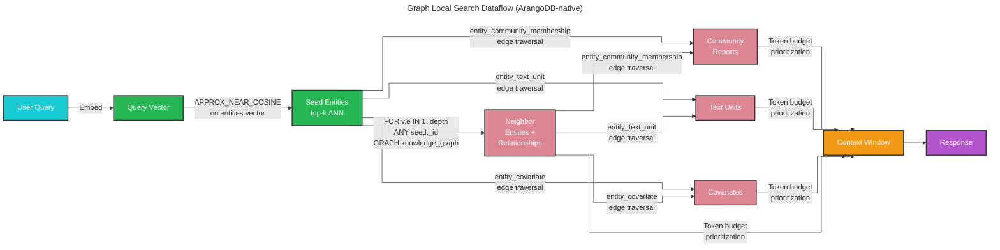

# Graph Local Search 🔎

## ArangoDB-Native Local Search

Graph local search (`--method graph-local`) is an ArangoDB-native alternative to [local search](local_search.md). Instead of loading parquet files into memory, it uses AQL graph traversal — `APPROX_NEAR_COSINE` vector ANN to find seed entities, then k-hop `GRAPH` expansion for neighbors, community reports, text units, and covariates. **ArangoDB is the single source of truth at query time.**

This method is well-suited for the same questions as local search (specific entities, relationships, or facts in your dataset) but with three additional advantages:

- **Lower memory footprint**: the full parquet index does not need to be loaded into the query process
- **Live consistency**: results always reflect the current state of the ArangoDB knowledge graph
- **Graph traversal depth**: k-hop expansion finds multi-hop neighbors that flat entity lookup may miss

> **Requires** `graph_store.enabled: true` in `settings.yaml` and a completed `graphrag index` run that has populated ArangoDB.

## Methodology



### Step-by-step

1. **Embed query** — the user query is embedded using the configured embedding model
2. **Vector seed** — `APPROX_NEAR_COSINE` on the `entities.vector` field (HNSW index) returns the top-k semantically closest entity documents
3. **k-hop expansion** — a single AQL `FOR v, e IN 1..depth ANY seed._id GRAPH knowledge_graph` query traverses outward from all seeds simultaneously, collecting neighbor entities and relationship edges. Seed entities are included in the result set.
4. **Edge traversal for context** — three further AQL traversals collect:
   - Community reports via `entity_community_membership` edges
   - Text units via `entity_text_unit` edges
   - Covariates via `entity_covariate` edges (when `extract_claims` was enabled during indexing)
5. **Token budget assembly** — entities, relationships, community reports, and text units are ranked and filtered to fit within `max_context_tokens`, using the same proportional budget logic as local search
6. **LLM response** — the assembled context is passed to the completion model

## Configuration

Graph local search has no dedicated config block. It uses parameters from two existing sections:

### From `local_search`

| Parameter | Description |
|-----------|-------------|
| `completion_model_id` | LLM for response generation |
| `embedding_model_id` | Embedding model for query vectorization |
| `prompt` | System prompt file |
| `text_unit_prop` | Fraction of token budget reserved for text units |
| `community_prop` | Fraction of token budget reserved for community reports |
| `top_k_entities` | Maximum number of entities to include in context |
| `top_k_relationships` | Maximum number of relationships to include in context |
| `max_context_tokens` | Total token budget for the context window |

### From `graph_store`

| Parameter | Description |
|-----------|-------------|
| `url`, `username`, `password`, `db_name` | ArangoDB connection |
| `graph_name` | Name of the ArangoDB named graph. Default: `knowledge_graph` |
| `traversal_depth` | k-hop depth for graph expansion. Default: `2` |
| `top_k_seeds` | Number of vector seed entities. Default: `10` |
| `store_vectors` | Must be `true` to enable hybrid ANN+graph search. Default: `true` |
| `vector_size` | Must match the embedding model's output dimension. Default: `3072` |

### Example `settings.yaml` excerpt

```yaml
graph_store:
  enabled: true
  url: "http://localhost:8529"
  username: root
  password: ${ARANGODB_PASSWORD}
  db_name: graphrag
  graph_name: knowledge_graph
  store_vectors: true
  vector_size: 1536      # must match your embedding model
  traversal_depth: 2
  top_k_seeds: 10

local_search:
  max_context_tokens: 12000
  top_k_entities: 10
  top_k_relationships: 10
```

## How to Use

```bash
graphrag query \
  --root ./my-project \
  --method graph-local \
  "What are the variants offered by Company?"
```

With streaming output:

```bash
graphrag query \
  --root ./my-project \
  --method graph-local \
  --streaming \
  "Describe the relationship between Agent Alpha and Company."
```

## Comparison with Local Search

| | `--method local` | `--method graph-local` |
|---|---|---|
| **Data source** | Parquet files loaded into RAM | ArangoDB live queries |
| **Parquet required at query time** | Yes | No |
| **Traversal** | In-memory entity list filtering | AQL k-hop graph traversal |
| **Multi-hop neighbors** | Indirect (via rank/weight) | Direct (via graph edges) |
| **Community reports** | Parquet-loaded, filtered by community level | AQL edge traversal |
| **Scalability** | Limited by RAM | Limited by ArangoDB |
| **Use when** | Fast prototyping, small graphs | Production, large graphs, live data |
