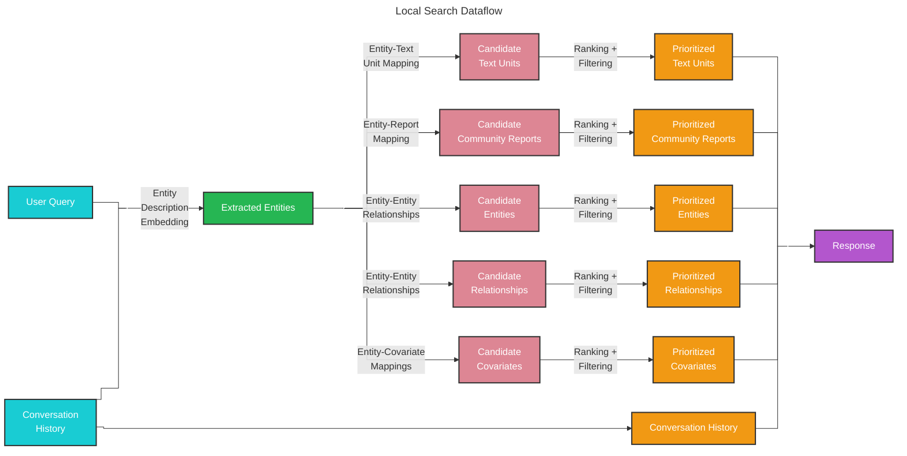

# Local Search 🔎

## Entity-based Reasoning

The [local search](https://github.com/microsoft/graphrag/blob/main/packages/graphrag/graphrag/query/structured_search/local_search/) method combines structured data from the knowledge graph with unstructured data from the input documents to augment the LLM context with relevant entity information at query time. It is well-suited for answering questions that require an understanding of specific entities mentioned in the input documents (e.g., “What are the healing properties of chamomile?”).

## Methodology



Given a user query and, optionally, the conversation history, the local search method identifies a set of entities from the knowledge graph that are semantically-related to the user input. These entities serve as access points into the knowledge graph, enabling the extraction of further relevant details such as connected entities, relationships, entity covariates, and community reports. Additionally, it also extracts relevant text chunks from the raw input documents that are associated with the identified entities. These candidate data sources are then prioritized and filtered to fit within a single context window of pre-defined size, which is used to generate a response to the user query.

## Configuration

Below are the key parameters of the [LocalSearch class](https://github.com/microsoft/graphrag/blob/main/packages/graphrag/graphrag/query/structured_search/local_search/search.py):

* `model`: Language model chat completion object to be used for response generation
* `context_builder`: [context builder](https://github.com/microsoft/graphrag/blob/main/packages/graphrag/graphrag/query/structured_search/local_search/mixed_context.py) object to be used for preparing context data from collections of knowledge model objects
* `system_prompt`: prompt template used to generate the search response. Default template can be found at [system_prompt](https://github.com/microsoft/graphrag/blob/main/packages/graphrag/graphrag/prompts/query/local_search_system_prompt.py)
* `response_type`: free-form text describing the desired response type and format (e.g., `Multiple Paragraphs`, `Multi-Page Report`)
* `llm_params`: a dictionary of additional parameters (e.g., temperature, max_tokens) to be passed to the LLM call
* `context_builder_params`: a dictionary of additional parameters to be passed to the [`context_builder`](https://github.com/microsoft/graphrag/blob/main/packages/graphrag/graphrag/query/structured_search/local_search/mixed_context.py) object when building context for the search prompt
* `callbacks`: optional callback functions, can be used to provide custom event handlers for LLM's completion streaming events

## Reranker (Cohere)

After the initial entity and text unit retrieval, an optional Cohere Reranker can rescore candidates by direct query relevance before the token-budget fill phase. This is a **single API call** for all candidates — not one call per document.

### Why it helps

The default token-budget fill is greedy: items are sorted by structural measures (graph rank, link count, text-unit count) and added until the budget is exhausted. Items that happen to rank lower structurally but are more relevant to the specific query may be cut. The reranker corrects this by reordering candidates by query relevance before the fill.

### Hybrid Text Unit Retrieval (Path A + Path B)

Standard retrieval derives text units from selected entities (`entity.text_unit_ids` — Path A). When a `text_unit_embeddings` store is provided, a **direct vector search** on text units is also performed (Path B). The union of both paths is reranked — replicating the classic RAG 150→15 oversampling pattern within GraphRAG.

```
Query
  ├── Path A (entity-derived):   top_k Entities → entity.text_unit_ids → Text Units
  └── Path B (direct, optional): similarity_search(text_unit_vectorstore, k=50) → Text Units
       ↓
  Union → Cohere Rerank → Token-Budget Fill
```

### Configuration

```python
from graphrag.query.context_builder.reranker import CohereReranker
from graphrag.query.structured_search.local_search.mixed_context import LocalSearchMixedContext

reranker = CohereReranker(
    api_key="your-cohere-api-key",  # or set COHERE_API_KEY in env
    model="rerank-v3.5",
)

context_builder = LocalSearchMixedContext(
    entities=entities,
    entity_text_embeddings=entity_vectorstore,
    text_embedder=embedding_model,
    text_units=text_units,
    relationships=relationships,
    community_reports=reports,
    # --- reranker options ---
    reranker=reranker,
    text_unit_embeddings=text_unit_vectorstore,  # enables Path B hybrid retrieval
    direct_text_unit_search_k=50,                 # candidates for Path B
)
```

Install the optional dependency:
```bash
pip install "graphrag[reranker]"
# or: pip install cohere>=5.0
```

## Context-Only Mode

Skip LLM generation and retrieve only the assembled context. Use this to integrate GraphRAG retrieval with your own inference pipeline.

```python
result = await engine.search("Your query", context_only=True)

# result.response == ""  — no LLM call was made
print(result.context_text)          # formatted context string (ready for any LLM)
print(result.context_data.keys())   # dict of DataFrames: entities, relationships, sources, ...
```

## Relationship Provenance (Linked Tables)

The context tables are cross-referenced so the LLM can trace every relationship back to its source:

| Table | New column | Content |
|-------|-----------|---------|
| **Relationships** | `source_id` | `short_id` of the primary source text unit |
| **Sources** | `relationship_ids` | Comma-separated `short_id`s of relationships in that chunk |

Example context output:
```
-----Relationships-----
id | source | target | description        | source_id
r1 | Alice  | Acme   | works at           | s1
r2 | Bob    | Acme   | works at           | s1

-----Sources-----
id | text                           | relationship_ids
s1 | Alice and Bob both work at...  | r1,r2
```

## How to Use

An example of a local search scenario can be found in the following [notebook](../examples_notebooks/local_search.ipynb).

