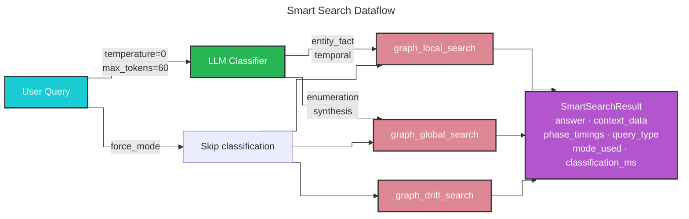

# Smart Search 🤖🔎

## Automatic Query Routing Across Graph Search Modes

Smart search (`--method smart`) classifies the incoming query with a fast LLM call and dispatches it to the most suitable ArangoDB-native search mode automatically. It is a convenience layer on top of [Graph Local Search](graph_local_search.md), [Graph Global Search](graph_global_search.md), and [Graph Drift Search](graph_drift_search.md) — the underlying search functions are unchanged.

> **Requires** `graph_store.enabled: true` in `settings.yaml` and a completed `graphrag index` run.

## Query Types and Routing

| Query type | Signal | Dispatches to |
|------------|--------|---------------|
| `entity_fact` | One specific named entity, product, or fact | `graph_local_search` |
| `temporal` | Explicit date or time period in the question | `graph_local_search` (with `from_date`/`until_date` extracted) |
| `enumeration` | List / find all members of a category | `graph_global_search` |
| `synthesis` | Patterns, roles, overviews, comparisons across many things | `graph_global_search` |

### Decision rule

```
ONE named thing              → entity_fact  → graph_local_search
LIST of unnamed things       → enumeration  → graph_global_search
Patterns / overview / roles  → synthesis    → graph_global_search
Explicit date range          → temporal     → graph_local_search
```

## Methodology



### Step-by-step

1. **Classify** — the query is sent to the configured completion model at `temperature=0`, `max_tokens=60`. The model returns a JSON object with `type`, `from_date`, and `until_date`.
2. **Config override** — a deep copy of the config is created. For `entity_fact` and `temporal` queries, `rerank.enabled` is set to `true` and `top_k_seeds` is raised to at least `20` for higher precision.
3. **Dispatch** — the appropriate search function is called with the overridden config and any extracted date hints.
4. **Return** — a `SmartSearchResult` is returned, extending the search result with routing metadata.

## Result

`smart_search()` returns a `SmartSearchResult` dataclass:

| Field | Type | Description |
|-------|------|-------------|
| `answer` | `str` | The generated response |
| `context_data` | `dict[str, DataFrame]` | Context tables passed to the LLM |
| `phase_timings` | `dict[str, float]` | Per-phase wall-clock times in ms, including `classification` |
| `query_type` | `str` | Classifier output: `entity_fact` \| `enumeration` \| `synthesis` \| `temporal` |
| `mode_used` | `str` | Which function was called: `graph_local_search` \| `graph_global_search` \| `graph_drift_search` |
| `classification_ms` | `float` | Time spent on the classifier LLM call in milliseconds |

## Configuration

Smart search uses no dedicated config block. The classifier uses `local_search.completion_model_id`. All other parameters come from `local_search`, `global_search`, and `graph_store` depending on the dispatched mode.

### Example `settings.yaml` excerpt

```yaml
graph_store:
  enabled: true
  url: "http://localhost:8529"
  username: root
  password: ${ARANGODB_PASSWORD}
  db_name: graphrag
  graph_name: knowledge_graph
  store_vectors: true
  traversal_depth: 2
  top_k_seeds: 10          # smart_search raises this to 20 for entity_fact/temporal

local_search:
  completion_model_id: default_completion_model
  embedding_model_id: default_embedding_model
  rerank:
    enabled: true          # smart_search enables this for entity_fact/temporal
    model: rerank-v4.0-pro
```

## How to Use

### CLI

```bash
graphrag query \
  --root ./my-project \
  --method smart \
  "What sensors does Company X use in their production line?"
```

### Bypass classification with `force_mode`

```bash
graphrag query \
  --root ./my-project \
  --method smart \
  --force-mode graph_drift \
  "Describe the key roles in the sales organisation."
```

`force_mode` accepts `graph_local`, `graph_global`, or `graph_drift`. Classification is skipped entirely.

### Python API

```python
import asyncio
from graphrag.config.load_config import load_config
from graphrag.api.smart_search import smart_search

config = load_config("./my-project")

result = asyncio.run(smart_search(
    config=config,
    query="Which products are currently end-of-life?",
))

print(result.answer)
print(f"Classified as: {result.query_type}, dispatched to: {result.mode_used}")
print(f"Classification took {result.classification_ms:.0f} ms")
```

### Inspect routing metadata

```python
result = asyncio.run(smart_search(config=config, query="..."))

print(result.query_type)       # e.g. "entity_fact"
print(result.mode_used)        # e.g. "graph_local_search"
print(result.classification_ms)
print(result.phase_timings)    # includes "classification" key
```

## When to Use Smart Search

| Use smart search when… | Use a specific mode when… |
|------------------------|--------------------------|
| Query type is not known in advance (e.g. user-facing chatbot) | You know the query type and want deterministic routing |
| You want a single entry point for all ArangoDB-native searches | Latency budget is very tight (saves the classifier LLM call) |
| You want routing metadata logged alongside the answer | You need to tune per-mode config independently |

## Comparison with Direct Search Modes

| | `--method smart` | `--method graph-local` | `--method graph-global` |
|---|---|---|---|
| **Routing** | Automatic (LLM classifier) | Fixed | Fixed |
| **Extra LLM call** | Yes (classifier, ~50–150 ms) | No | No |
| **force_mode** | Available | N/A | N/A |
| **Best for** | Unknown query mix, chatbots | Entity/fact queries | Broad/overview queries |
